# Tutorial para el manejo del repositorio Git de la clase

## 0. Creación del fork

Como primer paso se navegará hacia la página principal del curso, la cual será proporcionada por el profesor. En esta página se dará click en el botón que aparece a la derecha de la pantalla: *Fork*.

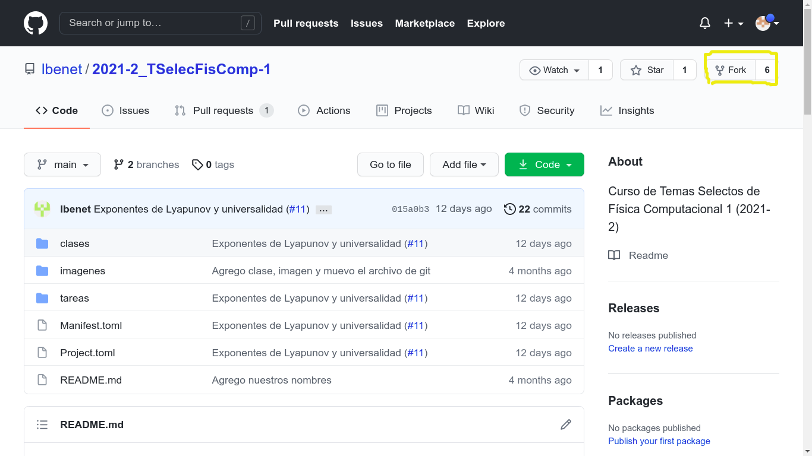

Esto nos enviará a nuestro fork que se ha creado. Nótese que nos encontramos en una copia del repositorio original ya que en la dirección el nombre ha cambiado. Hemos creado nuestro fork propio del curso!

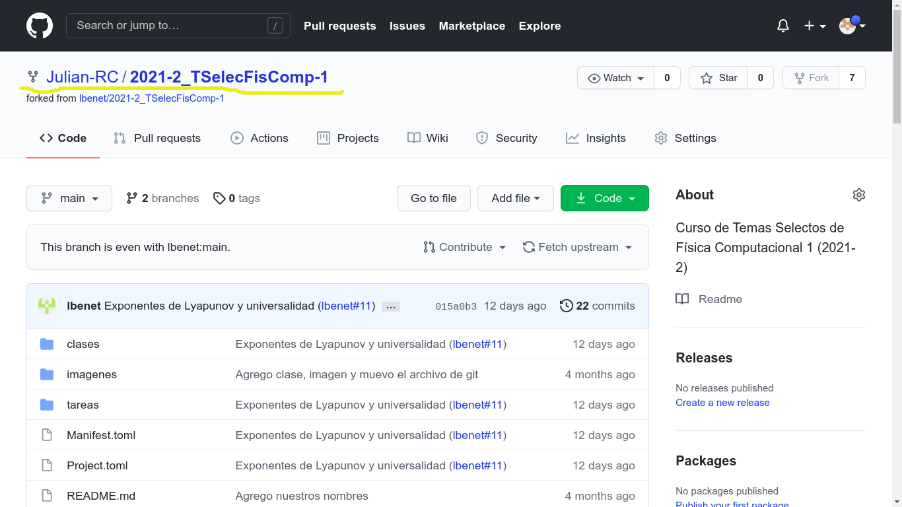

## 1. Clonar repositorio

Ahora regresaremos al **repositorio principal del curso**, ahí daremos click en el botón *CODE* y copiaremos la dirección, ya sea en https o ssh, todo depende de la configuración.

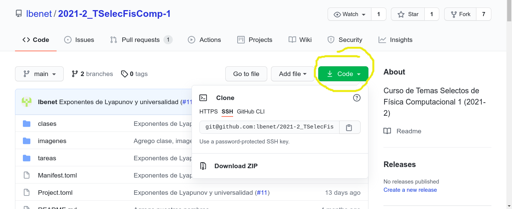

Ahora localizamos una capeta donde desemos colocar el curso y abrimos aquí una terminal (o bien navegamos hasta está carpeta). Por favor, traten de **no olvidarse** donde se encuentra. 

En este ejemplo, se ejecutará la siguiente orden:

 `git clone git@github.com:lbenet/2021-2_TSelecFisComp-1.git`

 En este punto sólo necesitan sustituir el link por el que ustedes tienen.

 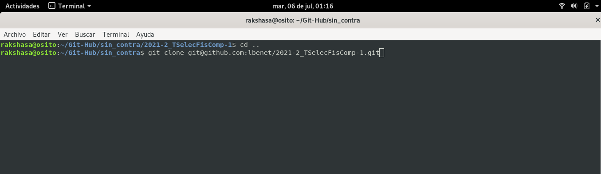

 Ahora lo que haremos será ligar nuestro repositorio con el fork que hemos creado anteriormente. De esta forma ahora nos iremos al link del fork **de cada uno de nosotros, no el del repositorio original**, en este punto obtendremos su link copiándolo otra vez después de presionar el botón *CODE*. En este ejemplo se usará el link de `ssh`, en el caso particular de cada uno dependera de su configuración.

 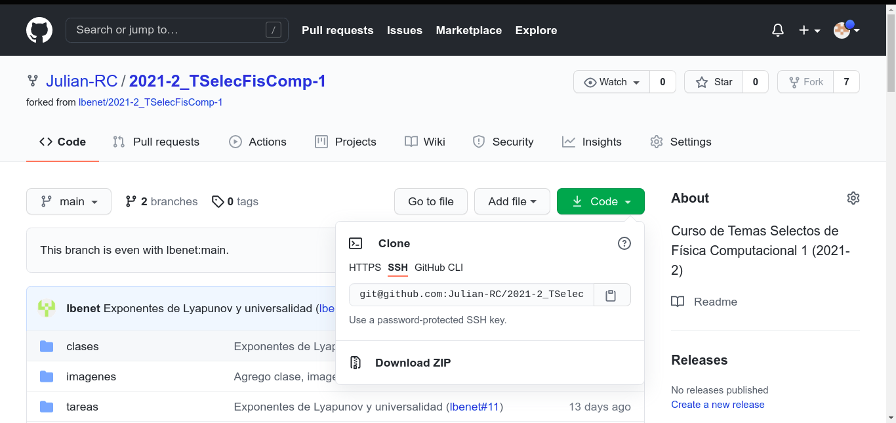

Después iremos a la carpeta donde esta nuestro repositorio que acabamos de clonar y entraremos en ella(en este caso ejecuto `cd 2021-2\_TSelecFisComp-1/` para este fin).

Posteriormente se ejecuta lo siguiente:

`git remote add mifork_2 git@github.com:Julian-RC/2021-2_TSelecFisComp-1.git`

que es `git remote add`+ *nombre de mi fork*+*link de mi fork*, el link debe ser el del fork que se copió en el paso anterior y el nombre del fork puede ser cualquiera, pero debes recordarlo ya que es muy importante.

 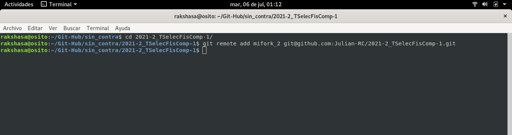

 Por último, ejecutamos:

`git remote -v`

para verificar que se encuentren tanto el *fork* que acabamos de hacer  (*mifork_2*), como el *origin* del curso, que es el que apunta al repositorio principal del curso.

 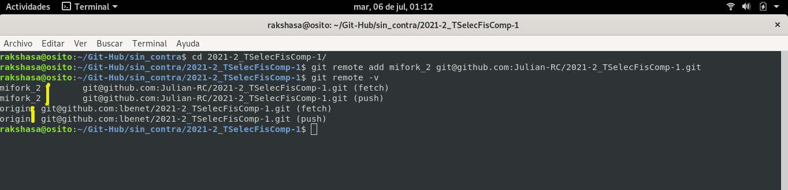

## 2. Durante el curso

- Para mantener actualizado tu fork, tal y como se explica en *01-git.md*, con el repositoro del curso se debe ejecutar:

    `git checkout main`

    `git pull origin`

    `git push mifork_2`

  Con *mifork_2* el nombre que se asigno al fork respectivo.

- **Durante el curso, cuando se revisen los notebook siempre trabajen en ramas, no trabajan en main, NUNCA**.

## 3. Subir Tareas

Primero asegurate de actualizar en `main` tu fork, tal y como se ejemplifica en la sección anterior.

Para subir la tarea se realizará el siguiente procedimiento.

 **Como paso principal y fundamental se debe hacer un nuevo branch**, en este caso el mío se llamará Tarea-1, el nombre es lo de menos, el branch se crea con el comando

 `git branch Tarea-1`

 Noten que esto se hace desde la carpeta del curso, en la rama *main*, que tenemos localmente.

  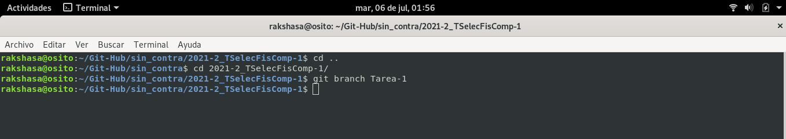

  Ahora para movernos a la rama debemos ejecutar:

`git checkout Tarea-1`

Espero que resulte claro que en caso de que la rama tenga un nombre distinto la última parte de la orden debe intercambiarse por el nombre asignado, es decir, si al branch la llamamos *rama_para_trabajar* entonces tendremos que ejecutar `git checkout rama_para_trabajar` para movernos a este branch.

Por último, confirmamos que estamos en la rama deseada realizando ejecutando `git branch`.

  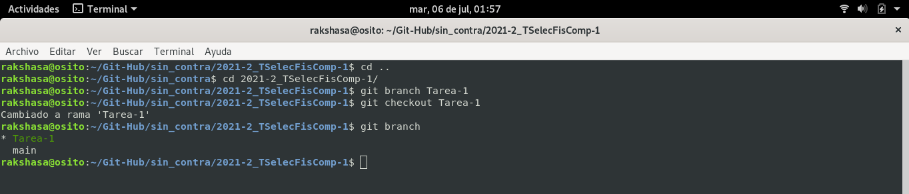

  Ahora será momento de ver donde colocar la tarea, primero entraremos en la carpeta de *Tareas*:

  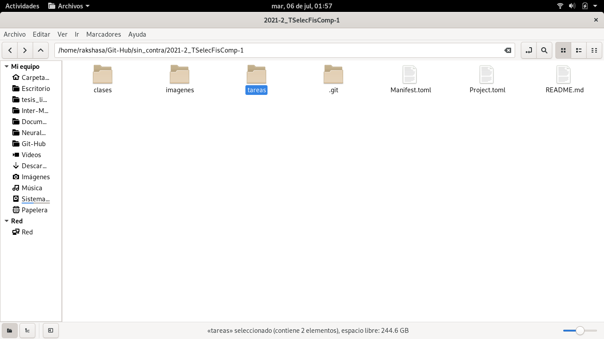

Dentro de la carpeta tareas crearás una carpeta con tu nombre, apellidos o nombres de los autores de la tarea:

  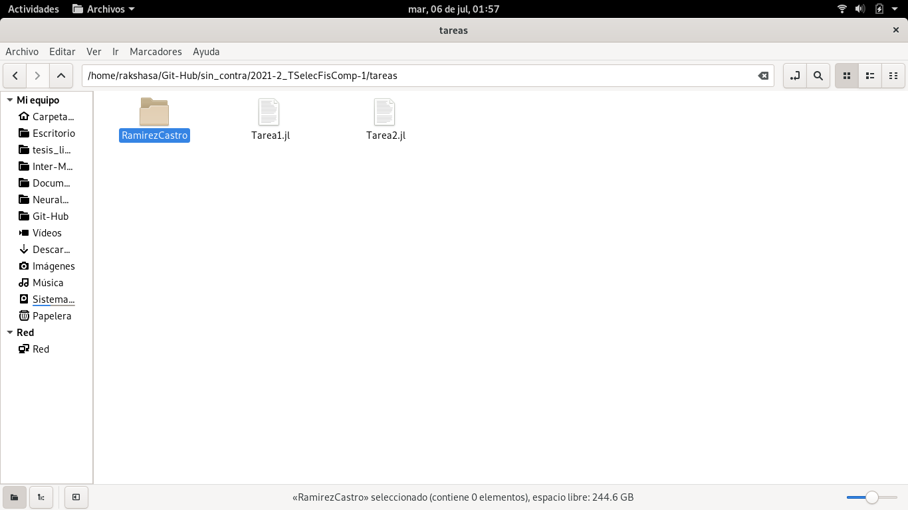

Y dentro de ésta copiarás el archivo con extensión .jl donde tienes tu tarea. **Ojo: no necesitamos ni los ipybn, ni .jpg, ni .png, etc. Que resultan como resultado de los ejercicios. Solo es necesario subir el .jl donde tienes el código e imagenes que se agreguen al trabajo de forma de apoyo, sólo si es absolutamente necesario para el desarrollo de su tarea**:

  

En este punto noten que yo agregue un archivo de la que se llama `Tarea2.jl`y mi rama se llama `Tarea-1`, esto es el nombre del branch no importa, lo importante es que ustedes identifiquen que rama corresponde a cada tarea, eso no lo deben de olvidar. 

Ahora para agregar el archivo y que nuestro git lo siga solo hacemos: 

`git add` + *dirección del archivo*

En este ejemplo que estoy realizando el código a correr se vería de la siguiente:

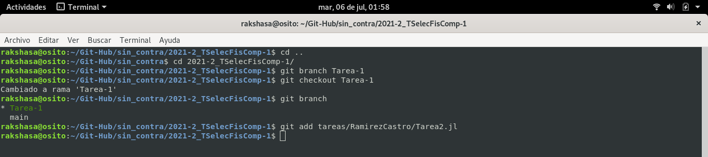

Ahora realizaremos un commit con los cambios como se ve en la imagen:

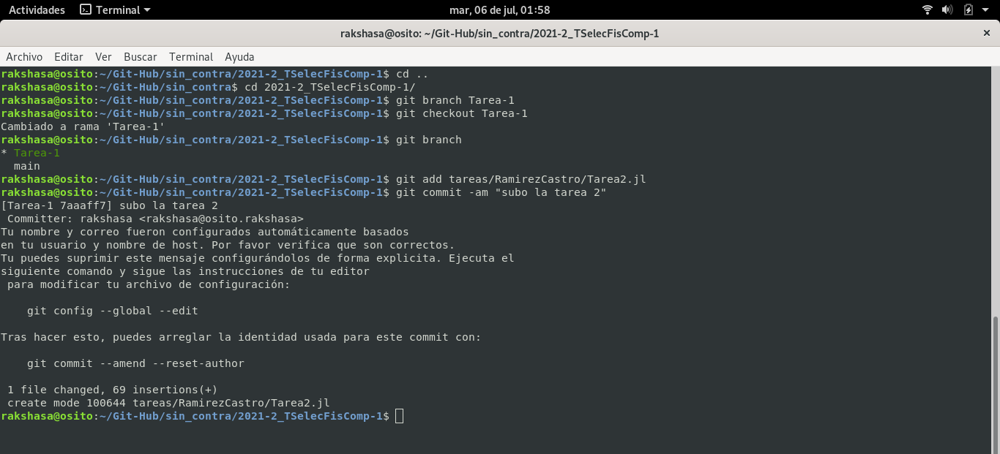

En este punto, es **muy importante recordar el nombre del fork**, además debes estar en el branch que creaste para esta tarea, si lo haces desde main tendrás problemas. Para subir los archivos agregados a tu fork en GitHub, será necesario ejecutar la siguiente línea:

`git push mifork\_2`

donde *mifork_2* es el nombre del fork que hemos escogido.

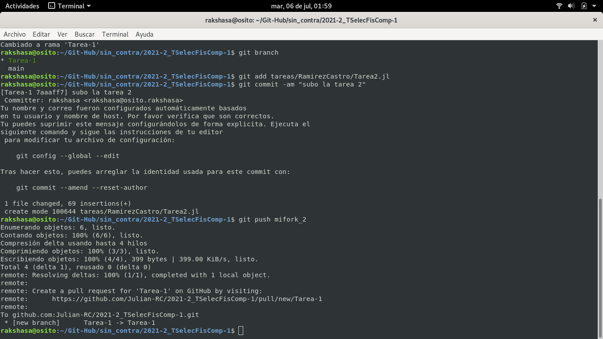

En caso de que salté un error relacionado con `upstream`o algo parecido, sólo es necesario ejecutarlo una vez y listo.

Hasta este punto sólo se ha subido a nuestro fork en GitHub pero aún no ha sido agregado al repositorio del curso.

Ahora si entras a tu fork en la web verás esta imagen, nota que el símbolo que está a la izquierda del letrero amarillo dice que subí un branch. Ahora sólo presionamos el botón `Compare & pull request`.

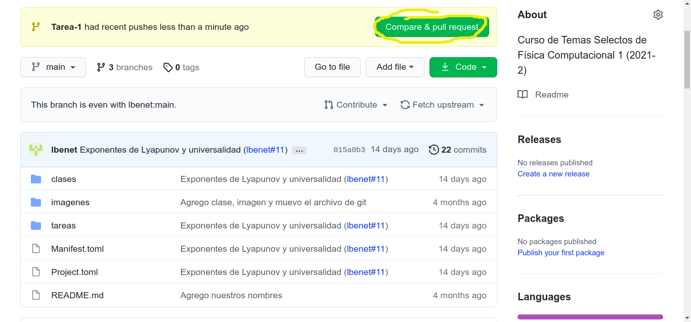

Nos mandará a una página donde es opcional agregar un mensaje para después subir el **pull request** que se ve de esta forma, nota que sólo cambia un archivo, esto se ve donde dice `Files changes`.
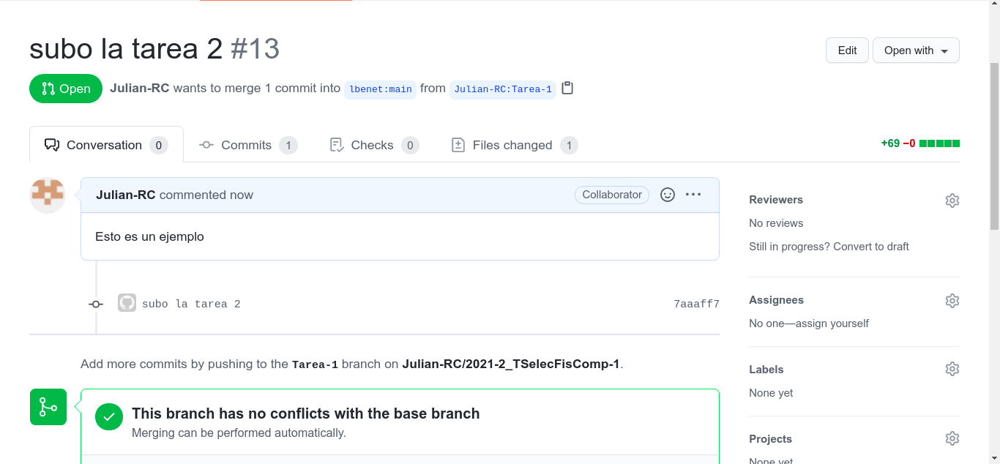

También observa que el archivo esta en la carpeta adecuada, en este caso `tareas/RamirezCastro/`, lo que implica que la tareas original no se ve afectada y tu trabajas en tu propia carpeta. 

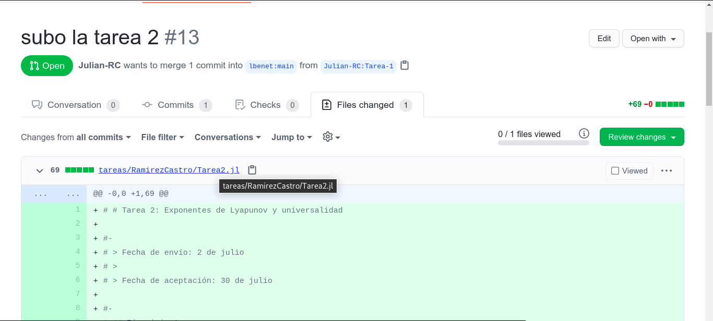

Como te diste cuenta es importante el nombre que le des al fork y siempre debes tener presente la rama en la que estás, **para cada tarea diferente crea una rama diferente**, en este caso durante esta tarea solo se necesita trabajar en esta rama.

## 4. Subir avances de la tarea

Ahora para subir avances  (yo realicé un pequeño cambio en el archivo que subí) sólo es necesario hacer un  `git add ...` y un `git commit -am ...` , realizas el `git push mifork_2 Tarea_1` igual que la vez anterior y eso es todo, ya esta en el repositorio del curso como un nuevo cambio al pull request que subiste!!!

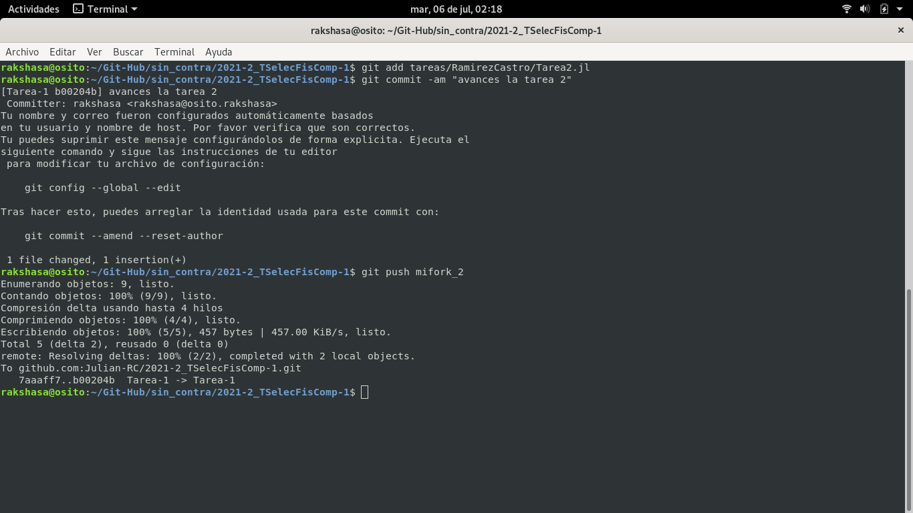

Si miras el pull request que esta en el repositorio de la clase tiene dos commits sin necesidad de ir a la web y dar otro click!!. Lo que esto significa es que tu rama es precisamente la actualización que se hace con el pull request al repositorio principal de la clase, con la consecuencia de que hagas ahí se subirá como tarea al hacer el `push`, y por eso ten cuidado qué editas :).

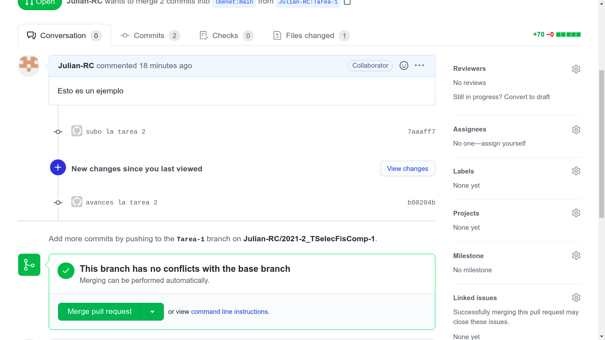

